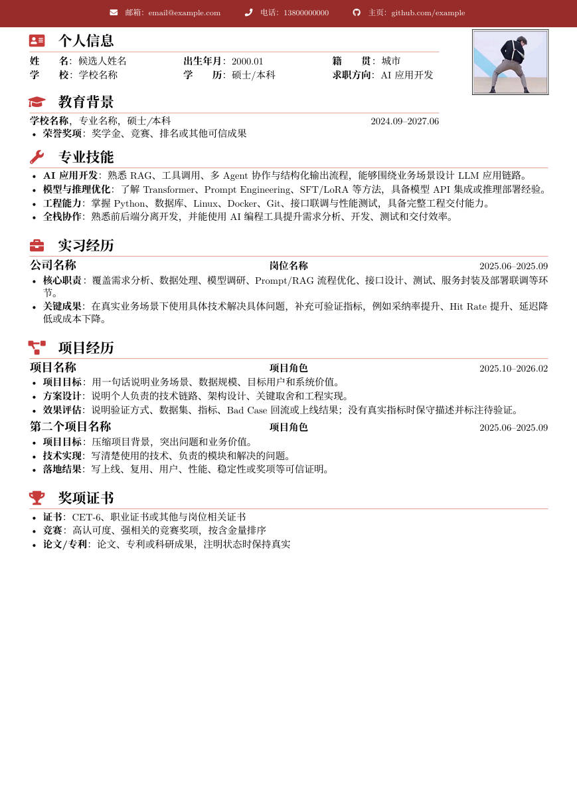

# AiDeveloperResume

一套面向中文软件求职场景的 LaTeX 简历模板与简历优化资料库。仓库包含算法/AI 应用、Java 后端、前端开发、测试开发等岗位方向模板，并配套两个 AI Agent skill：`resume-coach`（通用简历撰写/评估/JD 匹配/LaTeX 排版方法论）与 `resume-project-workflow`（本项目专属的评分模型、优化方向与协作约束）。



## 快速开始

本项目使用 XeLaTeX 编译中文简历，字体文件已内置在 `fonts/` 目录。

### 第 0 步：初始化本地数据文件（首次克隆必做）

`tex/data/profile.tex` 和 `tex/data/education.tex` 包含姓名、电话等真实个人信息，已被 `.gitignore` 忽略，仓库只提供 `*.example` 脱敏模板。首次克隆后必须先复制，否则编译时 `\input{tex/data/profile}` 会直接报错：

macOS / Linux（zsh、bash）：

```bash
cp tex/data/profile.tex.example tex/data/profile.tex
cp tex/data/education.tex.example tex/data/education.tex
```

Windows（PowerShell）：

```powershell
Copy-Item tex/data/profile.tex.example tex/data/profile.tex
Copy-Item tex/data/education.tex.example tex/data/education.tex
```

### 第 1 步：编译

**必须在仓库根目录执行**——模板通过相对路径 `fonts/` 加载内置字体，进入子目录编译会报找不到字体。

> ⚠️ 默认编译会把所有副产物（`.pdf`/`.aux`/`.log`/`.out`/`.synctex.gz`）落在**当前目录**，污染仓库根目录。务必带上 `-output-directory=.preview/<模板名>`，统一按模板收进子目录（该目录已在 `.gitignore` 忽略）：

```bash
# 编译算法 / AI 应用方向模板（产物进入 .preview/main_algorithm/）
xelatex -output-directory=.preview/main_algorithm main_algorithm.tex
xelatex -output-directory=.preview/main_algorithm main_algorithm.tex   # 再跑一遍，生成交叉引用

# 如果已安装 latexmk（需要 Perl），也可用仓库根目录的 .latexmkrc，产物进入 .output/
latexmk main_algorithm.tex
```

推荐使用 `latexmk`：仓库根目录的 `.latexmkrc` 已做如下自动化配置——

- 全部产物输出到 `.output/` 目录（不会污染仓库根目录）；
- 编译成功后 PDF 自动重命名为 `main_algorithm-YYYYMMDD.pdf`（带编译日期后缀，多次编译同一天覆盖、跨天归档）；
- `.aux`、`.log`、`.xdv` 等其余中间副产物在编译结束后**自动删除**，`.output/` 里只保留 PDF。

注意：直接用 `xelatex main_algorithm.tex` 编译不走 `.latexmkrc`，产物会留在当前目录且不会自动清理；编译失败时 `latexmk` 会保留 `.output/` 中的 `.log` 等文件便于排错。

可替换 `main_algorithm.tex` 为其他岗位模板：

| 文件 | 适用方向 |
| --- | --- |
| `main_algorithm.tex` | 算法工程师、AI 应用开发、大模型/RAG/Agent 相关岗位 |
| `main_backend.tex` | Java 后端开发、后端 + AI 应用研发 |
| `main_frontend.tex` | 前端开发、AI 产品前端、Web 应用开发 |
| `main_testdevelop.tex` | 测试开发、AI 应用测试与交付 |

批量编译全部模板：

```bash
# macOS / Linux（zsh、bash）
for f in main_*.tex; do latexmk "$f"; done
```

```powershell
# Windows（PowerShell）
Get-ChildItem main_*.tex | ForEach-Object { latexmk $_.Name }
```

## 本地编译方案

本地环境安装以下方案二选一，安装完成后回到「快速开始」执行编译。

### macOS

**方案一：MacTeX（推荐，一步到位）**

包含全部常用宏包（约 5 GB），安装后无需再补装任何依赖：

```bash
brew install --cask mactex
```

也可以到 [tug.org/mactex](https://www.tug.org/mactex/) 下载 pkg 安装包。安装完成后重启终端，执行 `xelatex --version` 验证。

**方案二：BasicTeX（轻量，约 100 MB，按需补装宏包）**

```bash
brew install --cask basictex

# BasicTeX 默认不带以下宏包，需手动补装
sudo tlmgr install fontawesome5 xecjk titlesec enumitem pgf fancybox environ trimspaces
```

编译时如果提示缺某个宏包（如 `fontawesome5.sty not found`），按报错提示执行 `sudo tlmgr install <宏包名>` 即可。

### Windows

**方案一：MiKTeX（推荐，缺失宏包自动安装）**

```powershell
winget install MiKTeX.MiKTeX
```

也可以到 [miktex.org](https://miktex.org/download) 下载安装器。安装后打开 `MiKTeX Console` → `Settings`，把 `Missing package installation` 设为 `Always`，首次编译时会自动安装 `fontawesome5` 等缺失宏包。

**方案二：TeX Live（全量安装）**

到 [tug.org/texlive](https://www.tug.org/texlive/) 下载安装器，包含全部宏包，安装耗时较长但后续无需补装。

**关于 latexmk**：MiKTeX 环境下 `latexmk` 依赖 Perl。如果需要用 `latexmk` 批量编译，请先安装 Strawberry Perl：

```powershell
winget install StrawberryPerl
```

不想装 Perl 的话，直接用 `xelatex main_*.tex` 命令编译即可，效果完全一致。

### 编辑器集成（可选）

#### VS Code + LaTeX Workshop 实时预览（推荐）

本项目已在 `.vscode/settings.json` 中预置实时预览配置：**编辑即自动重编译，右侧 PDF 标签页自动刷新（Overleaf 体验），所有产物进入 `.preview/<模板名>/`，不污染根目录。**

使用方法：

1. **用「打开文件夹」方式打开整个仓库**（`File → Open Folder` → 选 `AiDeveloperResume`）。
   ⚠️ 不要只双击打开单个 `.tex` 文件——那样 `.vscode/settings.json` 不会生效，产物会落回根目录。
2. 安装 **LaTeX Workshop** 扩展（首次打开会自动提示）。
3. 打开任意 `main_*.tex`，按 `Ctrl+Alt+B` 编译（或等自动编译触发），再按 `Ctrl+Alt+V` 打开 PDF，把 PDF 标签页拖到右侧即可左右分屏。
4. 编译产物会自动进入 `.preview/<模板名>/`（例如 `.preview/main_algorithm/main_algorithm.pdf`），根目录保持干净。

> `.vscode/settings.json` 中已设置 `latex-workshop.latex.build.forceRecipeUsage: true`，会忽略 `% !TeX program = xelatex` 魔术注释，强制使用仓库统一的 `xelatex-preview` recipe，确保产物始终进入 `.preview/<模板名>/`。

#### 只在终端里手动编译（最可靠，不依赖插件）

产物按模板分子目录，统一进 `.preview/<模板名>/`：

```bash
# 直接命令
xelatex -output-directory=.preview/main_algorithm main_algorithm.tex
xelatex -output-directory=.preview/main_algorithm main_algorithm.tex   # 再跑一遍
```

或一键脚本（仓库根目录已提供 `build.bat`，双击或在终端运行）：

```bash
build.bat                          # 弹出菜单，选择编译一个模板
build.bat main_algorithm.tex       # 编译指定模板
build.bat --all                    # 编译全部 main_*.tex
```

> 终端手动编译不经过 LaTeX Workshop 的 recipe 选择逻辑，因此不受 `% !TeX program` 魔术注释影响，稳定进入 `.preview/<模板名>/`。如果 VS Code 的 Build 按钮行为不稳定，直接用本方式即可。

#### 如何实现 Overleaf 式"左边改、右边实时预览"

1. 按上面方法编译一次，生成 `.preview/<模板名>/<模板名>.pdf`（例如 `.preview/main_algorithm/main_algorithm.pdf`）。
2. 在 VS Code 中打开 `main_algorithm.tex`，按 `Ctrl+Alt+V` 打开 PDF 预览。
3. 把 PDF 标签页拖到右侧（或右键 → Split Right），形成左右分屏。
4. 以后修改 `.tex` 后：
   - 如果开了 VS Code 自动编译且插件正常，1.2 秒后右侧 PDF 自动刷新；
   - 如果插件按钮还是落根目录/不刷新，在终端跑 `build.bat main_algorithm.tex` 重新编译，右侧 PDF 也会检测到文件变化并自动刷新。

> 核心原则：**编辑用 VS Code，编译用 `build.bat`/终端命令，预览用 VS Code 的 `Ctrl+Alt+V`**。这样既稳定，又能达到 Overleaf 的实时预览效果。

### 备选：Overleaf（不想装本地环境时）

把整个仓库打包上传 [Overleaf](https://www.overleaf.com) 也可以编译，注意两点：

1. 打开左上角 `Menu`，把 `Compiler` 设置为 `XeLaTeX`。如果日志第一行出现 `This is pdfTeX` 或 `preloaded format=pdflatex`，说明仍在使用 pdfLaTeX，中文字体宏包会直接报错。
2. Overleaf 项目里同样需要 `tex/data/profile.tex` 和 `tex/data/education.tex`——上传后按「第 0 步」把两个 `*.example` 文件重命名（去掉 `.example` 后缀）即可。

## 环境要求

- TeX 发行版（任选其一）：
  - macOS：MacTeX（推荐）或 BasicTeX + `tlmgr` 补装宏包
  - Windows：MiKTeX（推荐）或 TeX Live
- XeLaTeX 引擎
- 常用宏包：`fontspec`、`xeCJK`、`fontawesome5`、`titlesec`、`enumitem`、`tikz`、`hyperref`、`fancybox`、`geometry`
- 可选工具：`latexmk`（配合仓库根目录的 `.latexmkrc` 使用）。在 Windows + MiKTeX 环境中，`latexmk` 可能还需要 Perl；如果未安装 Perl，请直接使用 `xelatex` 命令编译。

如果 `fontawesome5` 缺失，请用你的 TeX 发行版包管理器安装：macOS 执行 `sudo tlmgr install fontawesome5`，Windows 在 MiKTeX Console 中安装或开启自动安装。

## 项目结构

```text
.
├── main_algorithm.tex              # 算法 / AI 应用方向简历模板
├── main_backend.tex                # Java 后端方向简历模板
├── main_frontend.tex               # 前端方向简历模板
├── main_testdevelop.tex            # 测试开发方向简历模板
├── .latexmkrc                      # latexmk 配置：XeLaTeX + 输出到 .output/ + PDF 日期后缀 + 自动清理副产物
├── .output/                        # latexmk 编译输出目录（git 忽略，仅保留带日期后缀的 PDF）
├── docs/
│   └── CV-preview.jpg              # 简历预览图
├── fonts/                          # 内置 Noto Serif SC 字体
├── images/                         # 页眉、照片、校徽等图片素材
├── tex/
│   ├── shared/
│   │   ├── preamble.tex            # 宏包、字体、颜色、页面和通用命令
│   │   └── components.tex          # 联系栏、个人信息和教育背景渲染组件
│   └── data/
│       ├── profile.tex.example    # 姓名、邮箱、电话、学校、照片等（脱敏模板，复制为 profile.tex 使用）
│       └── education.tex.example  # 通用教育背景（脱敏模板，复制为 education.tex 使用）
├── reference/                      # 简历素材、项目经历、复盘与参考模板
└── skills/                         # AI Agent skill（详见「Skills」章节）
    ├── resume-coach/               # 通用简历撰写/评估/JD 匹配/LaTeX 排版
    └── resume-project-workflow/    # 本项目专属：评分模型、优化方向、协作约束与编译预览
```

## 如何改成自己的简历

1. 选择最接近目标岗位的 `main_*.tex`。
2. 修改 `tex/data/profile.tex` 中的姓名、邮箱、电话、GitHub、学校和照片路径。
3. 修改 `tex/data/education.tex` 中的教育背景。
4. 在对应 `main_*.tex` 中修改 `\ResumeTargetRole`、专业技能、实习经历、项目经历和成果奖项。
5. 替换 `images/xjpic.jpg` 为自己的照片，或在 `tex/data/profile.tex` 中改成新的照片路径。
6. 编译并检查 PDF：中文换行、日期格式、技术名词大小写、链接是否可点击。

写入正式简历前，请确认所有项目指标、获奖、论文、上线情况和链接都能经得起面试追问。本仓库中的素材强调“真实事实 + 清晰表达”，不建议虚构经历或不可验证的量化结果。

## 参考素材

`reference/` 中的文件用于整理简历内容，不一定都适合直接放进最终简历，已按职责归档为子目录：

- `source/`：原始素材真相源（按人分组）
  - `Project_Experience_list.md`：项目经历素材清单
  - `Internship_Experience.md`：实习经历素材清单
- `interview/`：面试复习
  - `qwen_guid_review.md`：大模型简历素材、技术口径和面试复盘
- `samples/`：参考样例
  - `ai_developer_resume.md`：AI/后端方向简历样例（外部参考，非本人）
  - `Software_developer_resume.tex`：英文软件工程简历参考模板
- `projects/`：结构化项目库（按岗位分类，见 `projects/README.md`）

建议把 `reference/` 当作候选素材库：先筛选与目标 JD 相关的事实，再压缩进对应岗位模板。

## Skills（AI Agent 技能）

`skills/` 目录下提供两个配套简历工作流的 AI Agent skill：

### resume-coach（通用简历方法论）

`skills/resume-coach/` 是通用的简历撰写、评估、JD 匹配与 LaTeX 排版 skill，可复用于任意候选人/岗位：

- `SKILL.md`：skill 入口说明和工作流
- `references/`：程序员简历指南、JD 匹配、改写模式、LaTeX 排版规则
- `assets/latex/compact-ai-resume-template.tex`：可复用的紧凑型中文 AI/软件岗简历模板
- `agents/openai.yaml`：可选 agent 配置示例

#### 安装（详见 [skills/resume-coach/README.md](skills/resume-coach/README.md)）

`resume-coach` 已封装为标准 npm 包，可通过 npx 安装；也可手动挂载到本项目的 CodeBuddy：

```powershell
# 方式一：安装脚本（挂到项目级 .codebuddy/skills/）
node skills/resume-coach/bin/install.js --target codebuddy:project

# 方式二：软链（改源自动生效，开发推荐）
New-Item -ItemType Directory -Force .codebuddy/skills | Out-Null
New-Item -ItemType Junction -Path .codebuddy/skills/resume-coach -Target (Resolve-Path skills/resume-coach)
```

### resume-project-workflow（本项目专属工作流）

`skills/resume-project-workflow/` 沉淀自对本仓库的多次协作，固化本项目专属的约束与优化方向：

- 协作硬约束：不覆盖根文件、改动只落 `.temptest/`、方案先放 `.plan/`、git 回退、编译产物只进 `.preview/`
- 五维评分模型 + 4 点优化方向（Agent 岗锚点）
- 项目抽库方法论与本地编译预览工作流

挂载到本项目 CodeBuddy（软链，改源自动生效）：

```powershell
New-Item -ItemType Directory -Force .codebuddy/skills | Out-Null
New-Item -ItemType Junction -Path .codebuddy/skills/resume-project-workflow -Target (Resolve-Path skills/resume-project-workflow)
```

> 挂载后重启/刷新会话，`/skills` 面板即可看到，任务匹配 `description` 时自动触发。`.codebuddy/` 已被 `.gitignore` 忽略，克隆后需重新挂载（或将该目录例外进版本管理）。

示例需求：

```text
请使用 resume-coach 评估 main_backend.tex 是否匹配 Java 后端实习岗位。
请根据这份 JD 调整 main_algorithm.tex，保留真实事实，不新增未经确认的指标。
请把 source/Project_Experience_list.md 中的项目压缩成一页中文简历项目经历。
请对 main_algorithm.tex 做五维评分，并按 4 点优化方向给出 Before→After 方案。
```

## 编译排错

- 请使用 `xelatex`，不要用默认 `pdflatex` 编译中文模板。
- 报错 `tex/data/profile.tex not found`：首次克隆未执行「第 0 步」，先复制 `*.example` 文件。
- 报错找不到 `fonts/NotoSerifSC.otf` 字体：不在仓库根目录执行了编译。字体通过相对路径 `fonts/` 加载，请回到根目录重试。
- 提示 `fontawesome5.sty not found` 等宏包缺失：macOS 执行 `sudo tlmgr install <宏包名>`；Windows 在 MiKTeX Console 中安装，或开启缺包自动安装。
- 如果提示找不到图片，确认 `images/foot.png`、`images/xjpic.jpg` 等资源存在，或同步修改 `tex/data/profile.tex` 中的图片路径。
- 如果 PDF 生成但排版溢出，优先压缩项目经历、技能条目和荣誉奖项，而不是继续缩小字号。

清理编译产物（`latexmk` 已自动删除中间文件，PDF 产物统一在 `.output/`，生成物已在 `.gitignore` 中忽略，也可以不清理）：

```bash
rm -rf .output       # 删除全部编译输出（含带日期后缀的 PDF）
latexmk -C           # 仅按 latexmk 规则清理，带日期后缀的 PDF 需用上面的命令删除
```

## 开源发布说明

- 本仓库已忽略 LaTeX 编译产物、本地 MiKTeX 缓存和私有备份目录。
- 对外发布前，请检查模板中的姓名、电话、邮箱、照片、学校、公司和项目指标是否适合公开。
- 本仓库当前尚未包含 `LICENSE` 文件；正式开源前请由维护者选择许可证并加入仓库。

## 致谢

版式最初参考了 SEU 中文 CV 模板和 NPU 中文 CV 模板，并在中文程序员简历场景下进行了岗位化改造。
